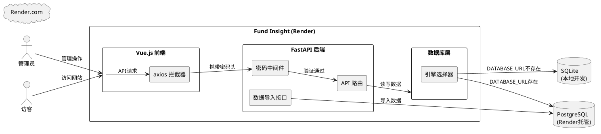

# **1. 实现模型**

## **1.1 上下文视图**



## **1.2 服务/组件总体架构**

### 修改涉及的模块

| 模块 | 文件 | 修改内容 |
|------|------|----------|
| 前端主页面 | `web/index.html` | 添加 axios 默认请求头配置（X-Access-Password） |
| 数据库模型 | `src/models/database.py` | 修复 init_db 日志、增强 PostgreSQL 连接池配置、添加引擎类型标识 |
| API 主入口 | `src/api/main.py` | 优化密码中间件（放行静态资源请求）、完善数据导入接口 |
| 部署配置 | `render.yaml` | 添加必要环境变量（ACCESS_PASSWORD、DATABASE_URL 等） |
| 环境变量示例 | `.env.example` | 添加 DATABASE_URL 和 ACCESS_PASSWORD 配置项 |

## **1.3 实现设计文档**

### 1.3.1 前端 axios 密码拦截器

**问题根因**：当前前端所有 axios 请求均未携带 `X-Access-Password` 请求头，而后端中间件对所有非健康检查请求强制验证该头。部署到 Render 后，前端页面能加载，但所有 API 调用均返回 401，导致页面无法正常工作。

**解决方案**：在 `index.html` 的 Vue app setup 中，通过 `axios.defaults.headers.common` 设置默认请求头。密码来源：
1. 优先从 `localStorage` 读取用户之前输入的密码
2. 如果 localStorage 中没有，弹出密码输入对话框
3. 密码验证成功后存入 localStorage

**实现要点**：
- 在 `createApp` 之前配置 axios 默认头
- 添加密码输入弹窗组件
- 添加 axios 响应拦截器：当收到 401 时，清除 localStorage 中的密码并重新弹出密码输入框
- 密码输入后先调用 `/api/health` 验证连接，再调用一个需要密码的接口（如 `/api/stats`）验证密码正确性

### 1.3.2 数据库引擎选择与连接池

**当前实现**：`database.py` 中已有基本的 PostgreSQL/SQLite 切换逻辑，但存在以下问题：
1. `init_db()` 函数中引用了 `DB_PATH` 变量，但在 PostgreSQL 模式下该变量未定义
2. PostgreSQL 连接未配置连接池参数
3. 缺少数据库类型的明确标识

**解决方案**：
- 添加 `DB_TYPE` 全局变量标识当前数据库类型（"postgresql" 或 "sqlite"）
- PostgreSQL 引擎添加连接池配置：`pool_size=5, max_overflow=10, pool_recycle=300`
- 修复 `init_db()` 日志输出，根据 `DB_TYPE` 显示不同信息
- 添加 PostgreSQL 连接重试和错误处理

### 1.3.3 密码中间件优化

**当前问题**：密码中间件拦截所有请求（除 `/api/health`），包括静态资源请求（JS、CSS、HTML），这可能导致前端资源加载失败。

**解决方案**：
- 放行所有非 `/api/` 路径的请求（静态资源、HTML 页面）
- 仅对 `/api/` 路径的请求验证密码
- 保留 `/api/health` 的放行逻辑

### 1.3.4 数据导入接口完善

**当前实现**：`/api/import-database` 接口已存在基本功能，但需要完善：
1. 导入时处理 PostgreSQL 的自增序列（SERIAL 类型导入后序列值不更新）
2. 添加更多表的导入支持
3. 改进错误处理和日志

**解决方案**：
- 导入完成后，对每张表执行 `SELECT setval(pg_get_serial_sequence(table_name, 'id'), (SELECT MAX(id) FROM table_name))` 重置序列
- 添加 `prediction_groups`、`batch_analysis_tasks` 等表到导入列表
- 改进逐行导入为批量导入，提升性能

### 1.3.5 render.yaml 配置完善

**当前问题**：render.yaml 缺少关键环境变量配置。

**解决方案**：添加以下环境变量组：
- `ACCESS_PASSWORD`：API 访问密码
- `DATABASE_URL`：从 Render PostgreSQL 服务获取的内部连接字符串
- `LLM_PROVIDER`：LLM 提供商选择
- `VOLCENGINE_API_KEY`：火山引擎 API Key
- `VOLCENGINE_BASE_URL`：火山引擎 Base URL
- `VOLCENGINE_MODEL`：火山引擎模型名

# **2. 接口设计**

## **2.1 总体设计**

本次修改不新增接口，仅优化现有接口行为：

| 接口 | 修改类型 | 说明 |
|------|----------|------|
| `POST /api/import-database` | 优化 | 增加序列重置、更多表支持、批量导入 |
| `GET /api/health` | 优化 | 返回数据库类型信息 |
| 所有 `/api/*` 接口 | 行为变更 | 密码中间件仅拦截 `/api/` 路径 |
| 所有静态资源 | 行为变更 | 不再被密码中间件拦截 |

## **2.2 接口清单**

### POST /api/import-database

**请求**：
- Content-Type: `multipart/form-data`
- Headers: `X-Access-Password: <password>`
- Body: `file` - SQLite 数据库文件（.db/.sqlite）

**响应**：
```json
{
    "success": true,
    "message": "数据库导入成功",
    "imported": {
        "bloggers": 5,
        "posts": 20,
        "predictions": 15,
        "viewpoints": 30,
        "fund_info": 10,
        "fund_history": 200,
        "sector_fund_mapping": 140,
        "investment_advice": 3,
        "crawler_article_records": 50,
        "prediction_groups": 2,
        "batch_analysis_tasks": 0
    }
}
```

### GET /api/health

**响应**（优化后）：
```json
{
    "status": "ok",
    "timestamp": "2026-04-22T10:00:00",
    "db_type": "postgresql",
    "version": "2.0.0"
}
```

# **4. 数据模型**

## **4.1 设计目标**

数据模型不发生结构性变更。本次修改仅涉及数据库引擎选择逻辑和连接配置。

## **4.2 模型实现**

### 数据库引擎选择逻辑

```
读取 DATABASE_URL 环境变量
├── 如果以 "postgresql" 开头
│   ├── DB_TYPE = "postgresql"
│   ├── engine = create_engine(DATABASE_URL, pool_size=5, max_overflow=10, pool_recycle=300)
│   └── 日志: "[数据库] 已初始化: PostgreSQL"
└── 否则
    ├── DB_TYPE = "sqlite"
    ├── engine = create_engine(f"sqlite:///{DB_PATH}")
    └── 日志: "[数据库] 已初始化: SQLite: {DB_PATH}"
```

### PostgreSQL 序列重置

导入数据后，对每张含自增 ID 的表执行：
```sql
SELECT setval(pg_get_serial_sequence('{table_name}', 'id'), COALESCE((SELECT MAX(id) FROM {table_name}), 1));
```
这确保后续 INSERT 操作能正确获取自增 ID。
